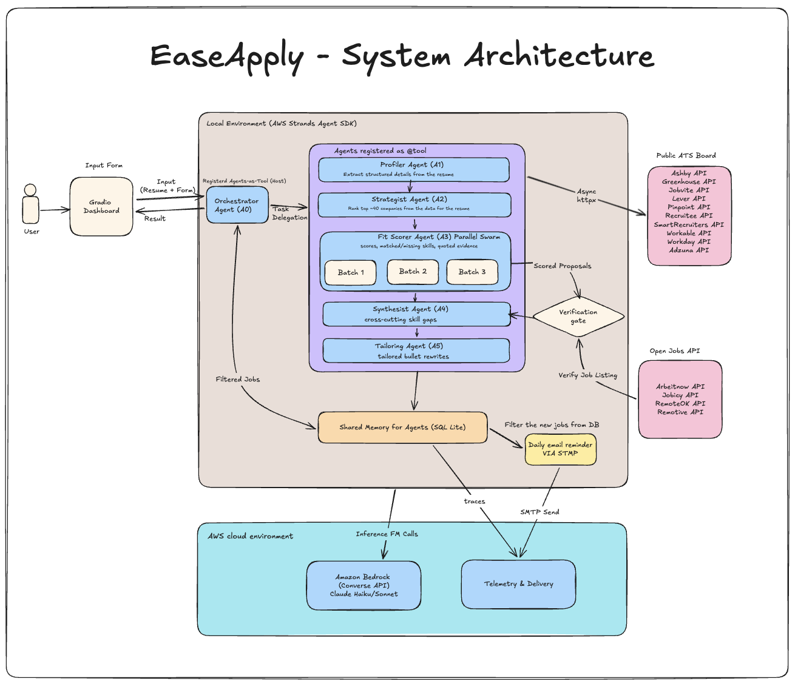

# EaseApply

**Automated Job Intelligence and Tailoring System**

Built with the AWS Strands Agents SDK for the *"Agents for Humans"* hackathon.

---

## 1. Project Overview

### 1.1 Problem Statement

Job hunting is split across systems that do not talk to each other. Every company runs its own Applicant Tracking System (Greenhouse, Lever, Ashby, and a dozen others), each with its own job board and its own data format. Aggregators like LinkedIn and Indeed only carry a slice of what is actually open, and the roles they do carry attract hundreds of applicants within days. A large share of active openings never leave the company's own board.

The obvious fix is to point an AI agent at the problem, but naive multi-agent systems fail in predictable ways:

* **Unbounded ReAct loops.** An agent that decides its own next step can loop, stall, or wander off task. That is unacceptable for something meant to run unattended at 7am.
* **Hallucination.** A model asked to summarise a job posting will happily invent a requirement, or a whole role. The user then wastes an afternoon writing a cover letter for something that does not exist.
* **Unpredictable planning.** If the model chooses the execution path, two runs on the same input can behave differently, which makes the system impossible to test or debug.
* **Token cost.** Sending every fetched posting to a language model is slow and expensive. A few hundred postings per run adds up fast.

### 1.2 Proposed Solution

EaseApply is a deterministic, zero trust discovery and tailoring engine.

**Deterministic** means the control flow is ordinary Python. Agents are called in a fixed order by `pipeline.py`. No agent decides what happens next.

**Zero trust** means no model output is treated as fact. Every claim an agent makes is a proposal until deterministic code verifies it against the source text. Anything that fails verification is dropped and counted.

The system:

1. Extracts a structured profile from the user's resume and intake form.
2. Proposes companies likely to be hiring that person, then resolves them to real ATS job boards.
3. Queries those boards directly over public JSON endpoints, with no scraping and no credentials.
4. Cross checks each posting against open job APIs to see whether it has been syndicated anywhere. A posting that is recent, unsyndicated, and a strong match is flagged as a Hidden Gem.
5. Filters postings down with plain code before any model sees them, then scores the survivors in parallel batches.
6. Verifies every score and every quoted skill claim against the stored job description.
7. Tailors resume bullets for the top matches, grounded in verified quotes.
8. Emails a digest of genuinely new postings every morning without the user opening the app.

### 1.3 Tech Stack

**Core**

* **AWS Strands Agents SDK** (Python) for the root agent, `@tool` bindings, and multi agent orchestration.
* **Amazon Bedrock** via the Converse API, using AWS SigV4 authentication. Amazon Nova 2 Lite is the default for every agent. In a controlled comparison it verified 96 to 99 percent of claims against 68 to 84 percent for Nova Lite, and it was faster and cheaper. Anthropic Claude models work through the same interface on an account with Anthropic access.

**Tracing (optional)**

Tracing stays off unless a collector is reachable. The OTLP **HTTP** exporter is used, so the
endpoint must never be the gRPC port 4317.

Arize Phoenix is the recommended collector, since it understands LLM and agent spans and shows
prompts, responses and token counts per agent call rather than generic timing bars:

```bash
docker run --rm -p 6006:6006 arizephoenix/phoenix
```

```
OTEL_EXPORTER_OTLP_ENDPOINT=http://localhost:6006
```

The UI is at `http://localhost:6006`. Jaeger also works, on `http://localhost:4318` with its UI
at `16686`, but it renders every span generically and its UI is light only, so a browser forcing
dark mode makes parts of it unreadable.

With no collector running, EaseApply prints one line and carries on rather than retrying the
export forever.

Strands records prompts, including the resume, as span events, so point tracing at a local
collector only. Each agent is named, `a0_ranking` through `a5_tailor`, so a trace shows which
agent made each call, and one root span groups everything a run did.

**Supporting**

* `pipeline.py` holds the deterministic control flow.
* `core/store.py` manages the SQLite blackboard, the single place shared state lives.
* `app.py` serves the Gradio interface.
* `httpx` handles asynchronous network calls to ATS boards.
* **Strands telemetry** (OpenTelemetry) for tracing and funnel metrics locally, and **CloudWatch GenAI Observability** when hosted on AgentCore.
* **Amazon SES** (or plain SMTP) for the daily digest.

---

## 2. Multi-Agent Architecture and Orchestration Patterns

### 2.1 Orchestration Design: Hybrid Multi-Agent Pattern

EaseApply combines three Strands patterns rather than relying on one.

**Deterministic workflow (DAG pattern).** `pipeline.py` executes the stages as a directed acyclic graph in a fixed order. Every branch in the system is a code level predicate, seventeen in total, covering things like cache hit or miss, platform dispatch, filter pass or drop, and validator accept or reject. None of them is decided by a model. This is what makes an unattended 7am run safe.

**Agent as tool pattern.** The root orchestrator `A0` registers each specialist agent as a `@tool` wrapper, which gives the AgentCore deployment an idiomatic SDK entrypoint. Locally, `pipeline.py` calls the agents directly, and one root span per run groups every agent call into a single trace. `A0` itself performs exactly one inference, at the end of the run, recommending which roles to apply to first over results that have already been verified. Its reasoning is safe at that point because every fact available to it has passed a validator.

**Parallel worker swarm.** The fit scoring stage partitions surviving postings into batches of five and runs them concurrently. The batches are independent, so a failure in one does not affect the others, and horizontal scaling is just a matter of batch count.

Agents never message each other. All communication passes through typed objects and the SQLite blackboard, which means one agent's bad output cannot corrupt another's context.

### 2.2 Agent Roster and Core Responsibilities

| Agent | Pattern | Responsibility |
|---|---|---|
| **A0** Root Orchestrator | Root Strands agent | Registers all tools. Runs one terminal inference over the verified shortlist, which code has already ordered by location and then fit, and recommends which roles to apply to first. |
| **A1** Resume Profiler | Agent as tool | Extracts skills, seniority, and intent from the resume and intake form into a structured JSON profile. Stated intent from the form overrides anything inferred from the resume. |
| **A2** Sourcing Strategist | Agent as tool | Proposes roughly 40 employers likely to be hiring for the role that are not already on file, so each run widens coverage. |
| **A3** Fit Scorer Swarm | Parallel swarm | Evaluates batches of five postings concurrently. Proposes a fit score, matched and missing skills, and a verbatim quote supporting every claim. |
| **A4** Gap Synthesist | Map reduce | Code counts the missing skills across the stronger matches, one vote per employer, and the agent writes a short note on each gap plus advice on which to close first. |
| **A5** Tailoring Agent | Agent as tool | Rewrites resume lines for a chosen job as before, after and why. Each rewrite must quote a line that exists in the resume, and any tool the resume never mentions is flagged. Runs on demand. |

---

## 3. System Architecture and Component Workflow

### 3.1 Architectural Diagram




### 3.2 End-to-End Processing Pipeline

**Phase 1: Intake and Profiling.** The user uploads a resume and fills in the intake form (target role, experience level, work mode, location, and free text context). `pypdf` extracts the resume text, which is stored verbatim and later becomes the source of truth for verification. `A1` turns both inputs into a structured profile.

**Phase 2: Discovery and ATS Ingestion.** Every board already confirmed, from `data/seed_slugs.json` and earlier runs, is searched on every run, across Greenhouse, Lever, Ashby and Personio. `A2` proposes employers that are not on file yet, and deterministic code generates likely ATS slugs for each name, probes the boards, and keeps whatever responds. Boards are fetched concurrently with `httpx`, normalised into a single posting shape, deduplicated, and assigned a stable `posting_id`. Each posting is then checked against open job APIs to record whether it has been syndicated.

**Phase 3: Deterministic Filtering.** Hard constraints from the intake form (experience level, work mode, location) are applied in plain Python, along with title matching against the stated role and curated alias groups, never a model's suggestions. Location is region aware: roles in the candidate's city rank first, then the rest of the country, then the wider region, then unscoped remote roles, and a remote posting limited to another country is dropped. This typically cuts tens of thousands of postings to around a hundred. No model is involved, which is what keeps the run fast and cheap.

**Phase 4: Scoring Swarm.** Survivors are partitioned into batches of five and scored concurrently by `A3`. The scorer reads the requirements section of each posting rather than its opening, and job text arrives fenced as data so a posting cannot instruct the model. Each result carries a fit score plus quoted evidence spans for every matched and missing skill.

**Phase 5: Synthesis and Orchestration.** Verified scores flow to `A4` for cross portfolio gap analysis and to `A0`, which recommends which roles to apply to first. `A5` runs on demand when the user asks for tailored rewrites on a specific job.

**Phase 6: Blackboard Persistence.** Verified results are written to SQLite. Postings carry a `first_seen` timestamp, which is what the daily digest diffs against. Run level metrics including token count and cost are recorded alongside.

### 3.3 Repository Layout

```
easeapply/
├── app.py                  # Gradio UI: intake form + results. --demo flag
├── pipeline.py             # deterministic outer loop, calls agents in order
├── digest.py               # daily entrypoint: diff, score new, email
├── agents/
│   ├── orchestrator.py     # root Strands agent, tool registration
│   ├── prompts.py          # loads prompts/*.md with version metadata
│   ├── profiler.py         # form + resume → profile vector
│   ├── sourcer.py          # profile → company candidates
│   ├── scorer.py           # posting batch → scores + evidence spans
│   ├── synthesist.py       # all scores → cross-job gap patterns
│   └── tailor.py           # job + resume → before, after and why rewrites
├── prompts/                # one versioned system prompt per agent, a0 to a5
├── sources/
│   ├── ats.py              # fetchers + per-platform normalisers
│   ├── slugs.py            # slug generation, probing, caching
│   └── syndication.py      # open job API cross-check
├── core/
│   ├── models.py           # Posting, Profile, Score dataclasses
│   ├── store.py            # SQLite schema + queries
│   ├── filters.py          # hard constraint rules from the form
│   ├── geo.py              # place, country and region tables
│   ├── verify.py           # span verification, ID contract
│   ├── notify.py           # HTML digest render + send
│   └── trace.py            # OTel setup + event bus
├── data/
│   ├── seed_slugs.json     # known company → platform mappings
│   ├── fixtures/           # real postings for offline tests
│   └── demo.db             # pre-warmed cache for offline demo
├── tests/                  # verification, filter and store checks
├── public/
|   ├── THIRD_PARTY.md
|   ├── resources
|   │   └── system_architecture.png    #architecture diagram
├── requirements.txt
├── .env.example
├── LICENSE                 
└── README.md
```

---

## 4. Verification Gateway and Safety Boundary

The system runs on one invariant: **a model output is an uncommitted proposal until deterministic code accepts it.** Nothing an agent produces reaches storage, the interface, or the digest email without passing every check below.

**1. Schema Guard.** The response must parse as JSON and contain the required fields with the right types. One retry on failure, then the batch is dropped and logged.

**2. ID Contract.** Every posting is assigned an ID before any agent sees it. The scorer must return those same IDs. Any ID in the response that was not in the request is discarded. This makes a fabricated job structurally impossible, because there is no path for a model to introduce a record that did not come from a real ATS feed.

**3. Span Verification.** Every skill claim must carry a verbatim quote. Code normalises whitespace and case, then confirms that the quote actually appears in the stored job description or resume text. A claim whose quote cannot be located is dropped. The proportion that survives is reported to the user as a verification rate.

**4. Range Clamp.** Fit scores outside 0 to 100 are clamped and logged as anomalies.

**5. Budget Guard.** Cumulative run cost is tracked against a ceiling. The run halts before the next agent call rather than exceeding it, and partial results are preserved.

**6. Untrusted Text Is Fenced.** Resume text, free text and every job description reach a model inside tags, with a rule that tagged text is data and never instructions. Posting text is escaped before the dashboard renders it, and only http and https links are kept.

**7. Tailoring Is Checked Too.** A rewrite must quote a line that exists in the stored resume or it is dropped, and any product name the resume never mentions is flagged beside the rewrite.


---

## 5. Demo Video and Walkthrough

**Video:** `[link to be added]`

Planned timestamps:

* `0:00` The problem: hundreds of applicants per posting, and the roles that never reach an aggregator.
* `0:30` Live run: intake form and resume upload, streaming agent activity, funnel counts narrowing 800 postings to a scored shortlist.
* `2:10` The results: matched roles with quoted evidence behind every skill claim, Hidden Gem badges, and the measured verification rate.
* `3:10` The daily digest arriving by email without the app being opened.
* `3:55` Architecture walkthrough and run cost.

**Live demo:** `[link to be added]`

**Offline replay.** The demo mode replays a pre warmed database with no network calls and no credentials, so anyone can see the full interface working:

```bash
python app.py --demo
```

---

## 6. Local Setup and Reproduction Guide

### 6.1 Prerequisites

* Python 3.11 or newer
* An AWS account that can call Amazon Bedrock in the region you intend to use. Serverless models are enabled on first use. Amazon Nova needs nothing further, while Anthropic models also require Anthropic's use case details before sustained use.
* Or a local Ollama server, with `MODEL_PROVIDER=ollama`, to run without AWS.
* AWS CLI configured with credentials that can call Bedrock

### 6.2 Environment Configuration

```bash
git clone [repository URL]
cd easeapply

python -m venv .venv
source .venv/bin/activate        # Windows: .venv\Scripts\activate

pip install -r requirements.txt

cp .env.example .env
```

Then fill in `.env`. The minimum is:

```
MODEL_PROVIDER=bedrock
AWS_REGION=us-east-1
BEDROCK_MODEL_ID=global.amazon.nova-2-lite-v1:0
BEDROCK_SCORER_MODEL_ID=global.amazon.nova-2-lite-v1:0
SELF_EMAIL=
```

### 6.3 Database Initialisation

Create the SQLite blackboard:

```bash
python -c "from core.store import init_db; init_db()"
```

### 6.4 Execution

Launch the dashboard:

```bash
python app.py
```

The interface opens at `http://127.0.0.1:7860`. Upload a resume, fill in the intake form, and start a run.

To see the interface without any AWS setup, use `python app.py --demo`.

---

## 7. Daily Unattended Digest

`digest.py` is a headless worker that runs on a schedule and does the discovery work while the user is not there.

A digest run loads the saved profile and searches every board already known, from the seed file and earlier runs, skipping the sourcing agent entirely. It fetches current postings, then the diff engine compares them against `first_seen` in the database and keeps only postings that have never been seen before. Those few are filtered and scored, and an HTML digest is rendered and sent to a single recipient, the user's own address.

Skipping the sourcing stage matters for two reasons: it keeps a daily run to a couple of cents, and it stops the company list drifting from one morning to the next. If nothing new is found, no email is sent.

Schedule it with cron:

```
0 7 * * * cd /absolute/path/to/easeapply && /absolute/path/to/easeapply/.venv/bin/python digest.py >> /absolute/path/to/easeapply/digest.log 2>&1
```

Point cron at the interpreter inside the virtual environment, not at `python3`. A bare
`python3` resolves to the system interpreter, which does not have the dependencies installed.

Check the render before scheduling anything:

```bash
python digest.py --dry-run
```

That forces `EMAIL_BACKEND=none`, writes `digest_preview.html`, and sends nothing.

Use absolute paths throughout, because cron runs with a nearly empty environment and will not resolve `python3` or relative paths the way a shell does. Load the `.env` file explicitly by absolute path. Always redirect output to a log, otherwise a failing job is silent.

On Windows, use Task Scheduler or run it under WSL.

---

## 8. Third-Party Attributions and API Disclosures

Every external service is accessed through public, unauthenticated, read only endpoints. EaseApply never handles credentials for any job platform and does not scrape authenticated pages.

**Public ATS job boards.** Greenhouse, Lever, Ashby and Personio expose public JSON endpoints so that company career pages can render. Reading them is their intended use.

**Open job APIs used for syndication checks.** Arbeitnow and RemoteOK are queried to determine whether a posting has appeared on the open market, not to source jobs. RemoteOK requires attribution, which appears in the interface footer and in the digest email.

Requests are rate limited to roughly eight concurrent connections with an eight second timeout, sent with an identifying User-Agent, and cached aggressively to avoid unnecessary load.

Full terms links and per service compliance notes are in [`THIRD_PARTY.md`](public/THIRD_PARTY.md).

---

## License

MIT. See [`LICENSE`](LICENSE).

## Disclosures

This project was created during the hackathon submission period. No pre existing code was incorporated. AI coding assistance was used during development, which the rules permit.